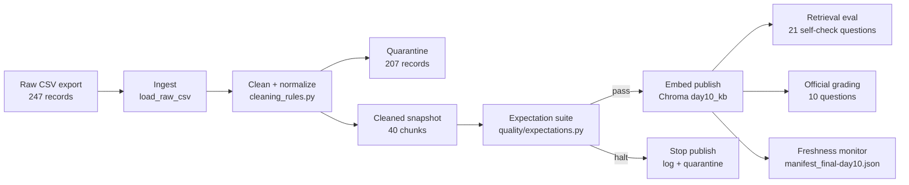

# Kiến trúc pipeline - Lab Day 10

**Nhóm:** Day 10 Technical Owners  
**Cập nhật:** 2026-06-10  
**Run production:** `final-day10`

---

## 1. Sơ đồ luồng

Điểm đo chính:
- `run_id`: ghi ở log, manifest, metadata Chroma.
- `raw_records`, `cleaned_records`, `quarantine_records`: ghi trong log và manifest.
- `latest_exported_at`: lấy từ cleaned rows sau normalize, dùng cho freshness.
- `embed_prune_removed`: chứng minh index được publish như snapshot, không giữ vector cũ.

---

## 2. Ranh giới trách nhiệm

| Thành phần | Input | Output | Owner nhóm |
|------------|-------|--------|------------|
| Ingest | `data/raw/policy_export_dirty.csv` | list raw rows, `raw_records=247` | Ingestion / Raw Owner |
| Transform | raw rows | `cleaned_final-day10.csv`, `quarantine_final-day10.csv` | Cleaning & Quality Owner |
| Quality | cleaned rows | expectation results, halt/warn decision | Cleaning & Quality Owner |
| Embed | cleaned CSV | Chroma collection `day10_kb`, upsert + prune by `chunk_id` | Embed & Idempotency Owner |
| Monitor | manifest JSON | `freshness_check=PASS/WARN/FAIL` with reason | Monitoring / Docs Owner |
| Eval | Chroma collection + golden questions | `eval_after_fix.csv`, `grading_run.jsonl` | Embed & Idempotency Owner |

---

## 3. Idempotency & rerun

Pipeline dùng `chunk_id = doc_id + seq + sha256(doc_id|chunk_text|seq)` sau clean/enrichment. Khi rerun:
- `upsert` ghi đè chunk có cùng id.
- `prune` xóa id không còn trong cleaned snapshot.
- Log `final-day10` hiện ghi `embed_upsert count=40 collection=day10_kb`.

Sau khi inject bad data, pipeline đã rerun `final-day10` để restore Chroma về snapshot sạch. Artifact chính:
- `artifacts/manifests/manifest_final-day10.json`
- `artifacts/cleaned/cleaned_final-day10.csv`
- `artifacts/quarantine/quarantine_final-day10.csv`
- `artifacts/eval/eval_after_fix.csv`
- `artifacts/eval/grading_run.jsonl`

---

## 4. Liên hệ Day 09

Day 10 không ghi trực tiếp vào vector store của Day 09. Collection `day10_kb` được giữ riêng để:
- Cho phép prune snapshot mạnh tay mà không phá index agent Day 09.
- Chứng minh data layer sạch trước khi nối vào orchestration layer.
- Cho Day 09 có thể migrate bằng cách đọc `manifest_final-day10.json`, dùng `cleaned_final-day10.csv`, hoặc query `day10_kb`.

Khi tích hợp production, retrieval worker Day 09 nên ưu tiên collection đã publish bởi Day 10 hoặc merge kết quả từ `day10_kb` với collection cũ theo `doc_id`, `run_id`, và freshness status.

---

## 5. Rủi ro đã biết

- `freshness_check=FAIL` trong final run vì `latest_exported_at=2026-04-11T00:00:00` đã quá SLA 24 giờ so với ngày chạy 2026-06-10. Đây là stale snapshot thật, không còn là lỗi parse timestamp.
- `data_privacy_guideline` và `security_policy` vẫn quarantine vì chưa có canonical source document và không nằm trong grading scope.
- `chroma_db/` không được commit; evidence chấm điểm dựa vào CSV/JSON/log/manifest.
- Rerank trong `retrieval_utils.py` là deterministic helper cho eval/grading Day 10, không thay thế thiết kế retrieval production của Day 09.
